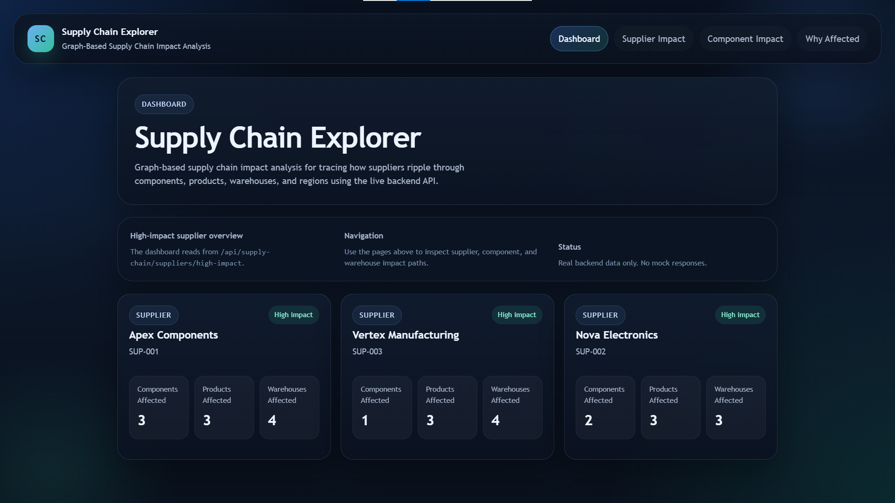
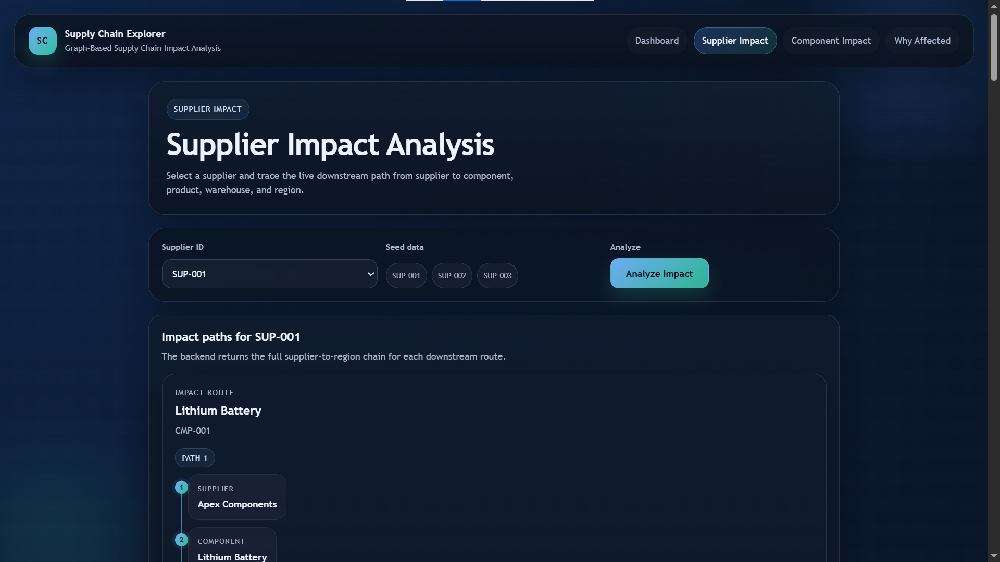
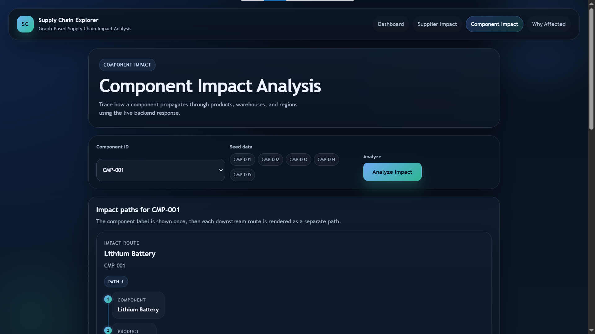
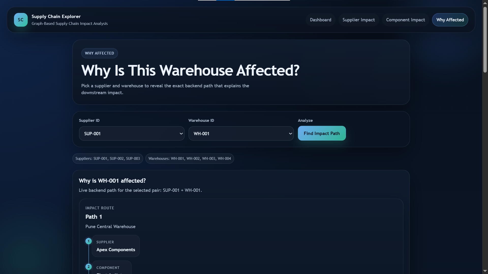

# Supply Chain Explorer

A graph-based supply chain impact analysis application built with **Spring Boot, Java 21, React, and CognoDB**.

Supply Chain Explorer helps identify how a supplier or component can affect downstream products, warehouses, and regions by traversing relationships in a graph database.

---

## 🚀 Problem Statement

Modern supply chains contain many interconnected entities such as suppliers, components, products, warehouses, and regions.

When a supplier or component is disrupted, it can be difficult to understand:

- Which products are affected?
- Which warehouses are affected?
- Which regions may be impacted?
- Why is a particular warehouse affected?
- Which suppliers have the largest downstream impact?

Traditional table-based approaches can make these relationship-based questions difficult to visualize and query.

**Supply Chain Explorer uses a graph database to model and traverse these relationships directly.**

---

## 💡 Solution

The application represents the supply chain as a connected graph:

```text
Supplier
   │
   │ SUPPLIES
   ▼
Component
   │
   │ USED_IN
   ▼
Product
   │
   │ STORED_AT
   ▼
Warehouse
   │
   │ LOCATED_IN
   ▼
Region
```

Products are also connected to categories:

```text
Product
   │
   │ BELONGS_TO
   ▼
Category
```

This graph structure allows the application to trace downstream impact through multiple relationships using Cypher queries.

---

## 🤔 Why a Graph Database?

A graph database is a natural fit for Supply Chain Explorer because the main problem is understanding relationships and dependencies between suppliers, components, products, warehouses, and regions.

In a relational database, finding the complete downstream impact of a supplier can require multiple JOIN operations across several tables.

With CognoDB, these relationships are represented directly as graph relationships, making multi-hop traversal straightforward:

```text
Supplier → Component → Product → Warehouse → Region
```

This allows the application to answer relationship-based questions such as:

- Which products depend on a supplier?
- Which warehouses may be affected?
- Which regions are impacted?
- Why is a particular warehouse affected?

The graph model also makes it easier to extend the supply chain with additional entities and relationships.

---

## ✨ Key Features

### Supplier Impact Analysis

Analyze the downstream impact of a supplier across components, products, warehouses, and regions.

```text
Supplier
   ↓
Component
   ↓
Product
   ↓
Warehouse
   ↓
Region
```

### Component Impact Analysis

Analyze how a component affects downstream products, warehouses, and regions.

```text
Component
   ↓
Product
   ↓
Warehouse
   ↓
Region
```

### Why Is This Warehouse Affected?

Given a supplier and warehouse, the application finds the graph path explaining their relationship.

```text
Supplier
   ↓
Component
   ↓
Product
   ↓
Warehouse
```

### High-Impact Supplier Analysis

Identifies suppliers with larger downstream impact based on:

- Components affected
- Products affected
- Warehouses affected

### Swagger / OpenAPI Documentation

Interactive API documentation is provided using Swagger/OpenAPI.

### Centralized Error Handling

The backend provides structured error responses for invalid or missing resources.

---

## 🕸️ Graph Data Model

### Nodes

```text
Supplier
Component
Product
Warehouse
Region
Category
```

### Relationships

```text
Supplier ──SUPPLIES──> Component

Component ──USED_IN──> Product

Product ──STORED_AT──> Warehouse

Warehouse ──LOCATED_IN──> Region

Product ──BELONGS_TO──> Category
```

---

## 🏗️ Architecture

```text
              React Frontend
                    │
                  Axios
                    │
                    ▼
            Spring Boot REST API
                    │
                    ▼
                 Services
                    │
                    ▼
              Cypher Queries
                    │
                    ▼
                  CognoDB
                    │
                    ▼
             Supply Chain Graph
```

---

## 🔌 REST APIs

### Production Backend

```text
https://supply-chain-explorer.onrender.com
```

### Local Backend

```text
http://localhost:8080
```

### Supplier Impact

```http
GET /api/supply-chain/suppliers/{supplierId}/impact
```

Example:

```http
GET /api/supply-chain/suppliers/SUP-001/impact
```

Production example:

```text
https://supply-chain-explorer.onrender.com/api/supply-chain/suppliers/SUP-001/impact
```

### Component Impact

```http
GET /api/supply-chain/components/{componentId}/impact
```

Example:

```http
GET /api/supply-chain/components/CMP-001/impact
```

### Why Affected

```http
GET /api/supply-chain/suppliers/{supplierId}/warehouses/{warehouseId}/why-affected
```

Example:

```http
GET /api/supply-chain/suppliers/SUP-001/warehouses/WH-001/why-affected
```

### High-Impact Suppliers

```http
GET /api/supply-chain/suppliers/high-impact
```

---

## 📸 Screenshots

### Dashboard



### Supplier Impact



### Component Impact



### Why Affected



---

## 🛠️ Technology Stack

### Backend

- Java 21
- Spring Boot
- Spring Web
- Maven
- CognoDB
- Cypher
- Swagger / OpenAPI

### Frontend

- React
- Vite
- JavaScript
- Axios
- React Router

### Tools

- IntelliJ IDEA
- Postman
- Git
- GitHub

### Deployment

- Render

---

## 📁 Project Structure

```text
supply-chain-explorer/
│
├── src/
│   ├── main/
│   │   ├── java/
│   │   │   └── com/supplychain/explorer/
│   │       ├── config/
│   │       ├── controller/
│   │       ├── exception/
│   │       └── service/
│   │
│   └── resources/
│       └── application.properties
│
├── frontend/
│   ├── src/
│   │   ├── components/
│   │   ├── pages/
│   │   ├── services/
│   │   └── utils/
│   ├── package.json
│   └── vite.config.js
│
├── screenshots/
│   ├── dashboard.png
│   ├── supplier-impact.png
│   ├── component-impact.png
│   └── why-affected.png
│
├── pom.xml
├── README.md
└── .gitignore
```

---

## ⚙️ Environment Variables

Database credentials are not stored directly in the source code.

Configure the following environment variables:

```text
COGNODB_URI
COGNODB_USERNAME
COGNODB_PASSWORD
```

The backend uses:

```properties
cognodb.uri=${COGNODB_URI}
cognodb.username=${COGNODB_USERNAME}
cognodb.password=${COGNODB_PASSWORD}
```

### Creating a CognoDB Instance

1. Create a CognoDB Cloud account.
2. Create a free `c0` instance and select a region.
3. Copy the generated connection URI.
4. Save the generated password for the `cognodb` user.
5. Configure the connection details using environment variables.

Example:

```text
COGNODB_URI=bolt+s://<instance-id>.databases.cognodb.cloud
COGNODB_USERNAME=cognodb
COGNODB_PASSWORD=<your-password>
```

**Never commit actual database credentials to GitHub.**

---

## 🌱 Seed Data

The application includes seed data representing a connected supply chain containing:

- Suppliers
- Components
- Products
- Warehouses
- Regions
- Categories

The seed data establishes the relationships required for supplier impact, component impact, warehouse impact path, and high-impact supplier analysis.

---

## 🔍 Main Cypher Queries

The application uses parameterized Cypher queries to traverse the supply chain graph.

### Supplier Impact Query

The supplier impact analysis starts from a supplier and follows downstream relationships:

```text
Supplier
   ↓ SUPPLIES
Component
   ↓ USED_IN
Product
   ↓ STORED_AT
Warehouse
   ↓ LOCATED_IN
Region
```

This multi-hop traversal identifies the components, products, warehouses, and regions that may be affected by a supplier.

### Component Impact Query

The component impact analysis starts from a component and traverses downstream dependencies:

```text
Component
   ↓ USED_IN
Product
   ↓ STORED_AT
Warehouse
   ↓ LOCATED_IN
Region
```

This identifies the products, warehouses, and regions that depend on the selected component.

### Warehouse Impact Path Query

The warehouse impact analysis finds the relationship path connecting a supplier to a selected warehouse:

```text
Supplier
   ↓ SUPPLIES
Component
   ↓ USED_IN
Product
   ↓ STORED_AT
Warehouse
```

The returned path is displayed in the React frontend to explain why the selected warehouse is affected.

### High-Impact Supplier Query

The high-impact supplier analysis identifies suppliers with greater downstream impact based on their connected:

- Components
- Products
- Warehouses

All user-provided identifiers are passed as parameters rather than being concatenated directly into Cypher queries.

---

## ▶️ How to Run

### Backend

From the project root:

```powershell
.\mvnw.cmd spring-boot:run
```

Backend:

```text
http://localhost:8080
```

### Frontend

Open another terminal:

```powershell
cd frontend
npm install
npm run dev
```

Frontend:

```text
http://localhost:5173
```

Run both the backend and frontend to use the complete application.

---

## 🌐 Deployed Application

### Backend

```text
https://supply-chain-explorer.onrender.com
```

### Production API Example

```text
https://supply-chain-explorer.onrender.com/api/supply-chain/suppliers/SUP-001/impact
```

The backend is deployed and accessible through the production REST API.

---

## 📖 Swagger / OpenAPI

Swagger/OpenAPI documentation is available when running the backend locally.

After starting the backend, open:

```text
http://localhost:8080/swagger-ui/index.html
```

OpenAPI specification:

```text
http://localhost:8080/v3/api-docs
```

> Note: Swagger is included as part of the backend documentation, while the deployed application is primarily demonstrated through the REST APIs and React frontend.

---

## 🔄 Application Flow

```text
User selects a supplier/component
              ↓
        React Frontend
              ↓
          Axios Request
              ↓
      Spring Boot REST API
              ↓
           Service
              ↓
        Cypher Query
              ↓
            CognoDB
              ↓
      Graph Relationships
              ↓
        Impact Analysis
              ↓
        React UI Result
```

---

## 🎯 What This Project Demonstrates

- Graph database modeling
- Cypher query development
- Multi-hop relationship traversal
- Relationship-based impact analysis
- Spring Boot REST API development
- React frontend development
- Full-stack API integration
- Centralized exception handling
- Swagger/OpenAPI documentation
- Environment-based configuration
- Git and GitHub workflow
- Backend deployment
- REST API integration with a deployed frontend

---

## 🔮 Future Scope

- Advanced graph visualization
- Real-time supply chain data
- Supplier risk scoring
- Historical impact analysis
- Supply chain disruption alerts
- AI-assisted impact explanations
- Further production deployment improvements

---

## 👨‍💻 Author

**Pranav Chavan**

B.Tech Computer Science Engineering

---

## 📄 License

This project was developed for educational, assessment, and portfolio purposes.
